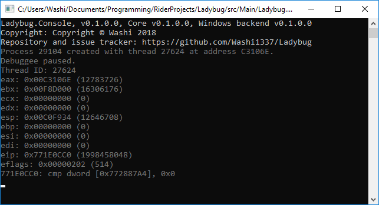
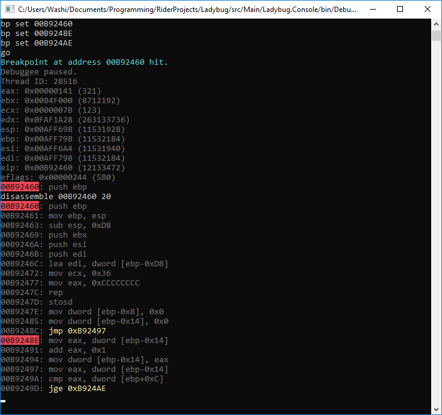
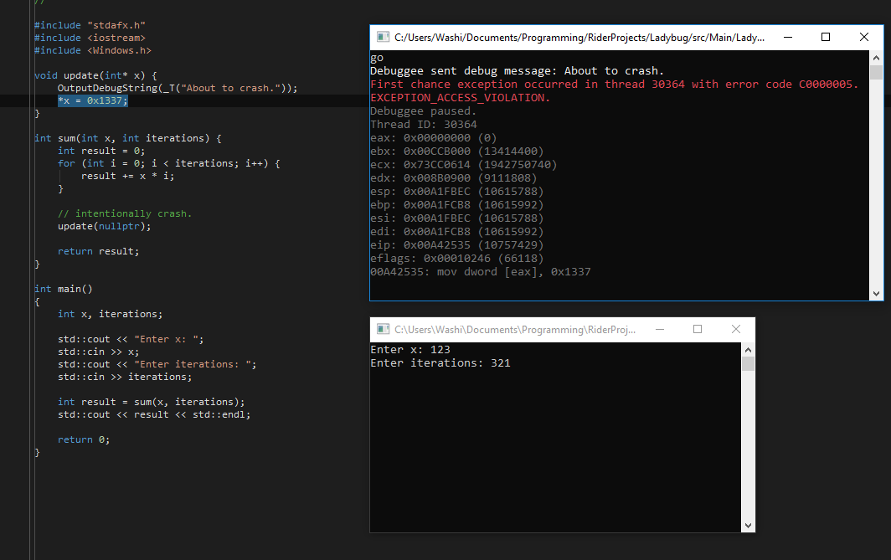

# Ladybug

Ladybug (or LaDbg) is a debugger that allows users to disassemble and debug native and .NET applications, regardless of whether the source of the target application is available or not.

The Ladybug project is written in C# and consists of reusable core libraries that exposes debugging capabilities to .NET applications.

## Features

- Launch any application in the debugger.
- Break execution at any given time.
- View and edit x86 register values.
- Disassemble x86 assembly code with instruction highlighting.
- Set breakpoints in the x86 code.
- Step through the x86 code.
- View loaded libraries.
- Dump and edit memory.
- Receive debug messages given by functions such as OutputDebugString or Debug.Print.

## Todo

Ladybug is a project that is still in development. Below is a non-exhaustive list that is still in the works:

- Graphical user interface.
- Stack view.
- Modifying x86 code.
- 64-bit application debugging.
- More .NET-specific debugging capabilities, such as IL debugging and heap dumps.
- Plugins support

## Libraries used

The Ladybug project is powered by the following libraries:

- Kernel32.dll: Used as a backend for windows application debugging.
- [AsmResolver](https://github.com/Washi1337/AsmResolver) : Disassembly of applications. 

## Contributing 

## Screenshots

Startup:

Disassembly and breakpoints:

Exception handling:

